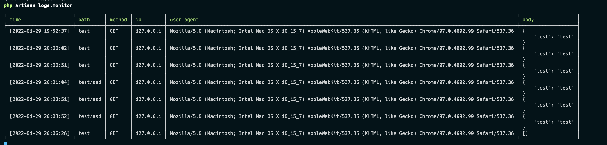

## Laravel Logable is a simple way to log http request in your Laravel application.

## Requirements

php >= 7.4

Laravel version >= 6.0

## Installation
``` 
composer require sagar290/laravel-logable
```

To register service provider you need to add this line in your `config/app.php` file.
``` php
'providers' => [
    ...
    Sagar290\Logable\LogableServiceProvider::class,
],
```

also, you need add this configuration in `config/logging.php` file.

``` php
'logable' => [
    'driver' => 'daily',
    'path' => storage_path('logs/logable.log'),
    'level' => 'debug',
],
```

Add this middleware to your `app/Http/Kernel.php` file.
``` php
protected $middleware = [
    ...
    \Sagar290\Logable\Middleware\RouteLogMiddleware::class,
];
```

Publish configuration file.
``` php
php artisan vendor:publish --provider="Sagar290\Logable\LogableServiceProvider" --tag="config"
```

## Commands

### monitoring logs
``` php
php artisan logs:monitor
```


This will live monitor all incoming requests and log them to the log file.


### Clear logs
``` php
php artisan logs:clear
```
This will clear all logs.

## Conclusion
Please feel free raise an issue if you have problem. Also, feel free to star this repository on [Github](https://github.com/sagar290/laravel-logable). Contribute to this project by making a pull request.
